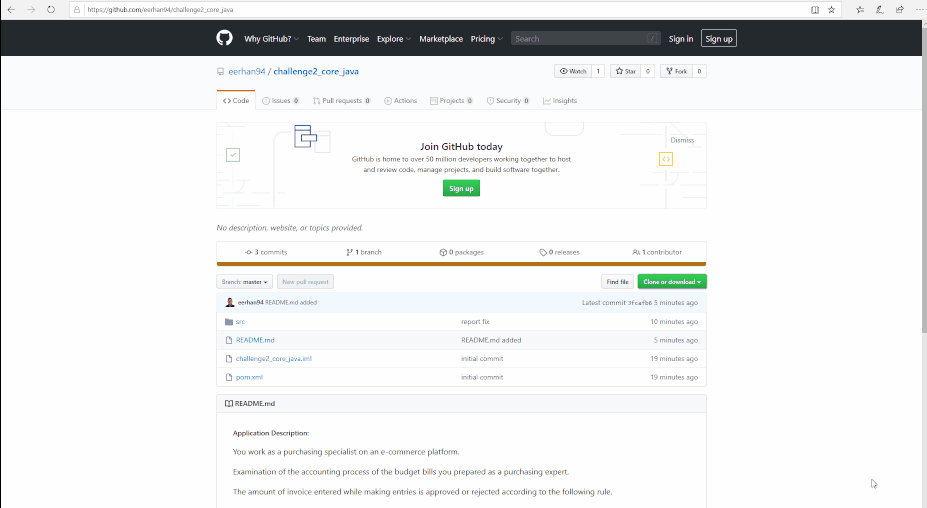

##### Application Description:

You work as a purchasing specialist on an e-commerce platform. 

Examination of the accounting process of the budget bills you prepared as a purchasing expert.

The amount of invoice entered while making entries is approved or rejected according to the following rule.

##### Rules:

New billing information will be entered into the accounting system, so if the total of all the APPROVED invoices entered is above the APPROVED specified limit, it is APPROVED if it does not exceed the limit.

LIMIT VALUE is the same for all purchasing specialists in the application. 

##### Sample process information: "Jane,Doe,jane@doe.com,199,IPhone 8,TR0001"

Each purchasing specialist is individually identified by the name, surname and E-mail.

Purchasing specialists with the same name and surname but different email addresses are evaluated separately.

##### Technical Requirements:

Java 8 (jdk1.8.0_131)

apache-maven-3.x.x (apache-maven-3.6.3)

You can see the application compile and usage steps in the following GIF

-> git clone https://github.com/eerhan94/challenge2_core_java.git

-> mvn clean test compile assembly:single

-> cd target

-> java -jar challenge2_core_java-1.0-SNAPSHOT-jar-with-dependencies.jar